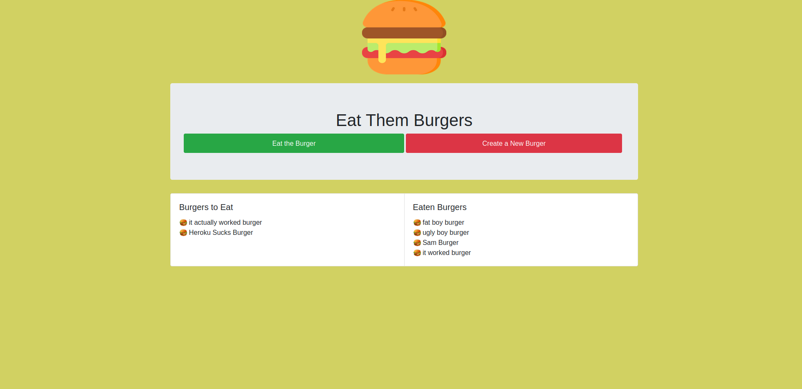

# EAT THE BURGER



## Dependancies
* express
* express-handlebars
* pg (postgresql)
* pg-hstore
* sequelize
```
npm install express express-handlebars pg pg-hstore sequelize

```
## Run Application Locally
* Configure config/connection.js to your database
* Run:
```
npm start
```
## Use
This app was built to demonstrate how to create a full-stack applcation using MVC. It creates burgers and eats them upon user-input. Behind the scenes it uses sequelize to communicate with the postgresql database and update information accordingly. It uses handlebars to display this information to user in the browser.
